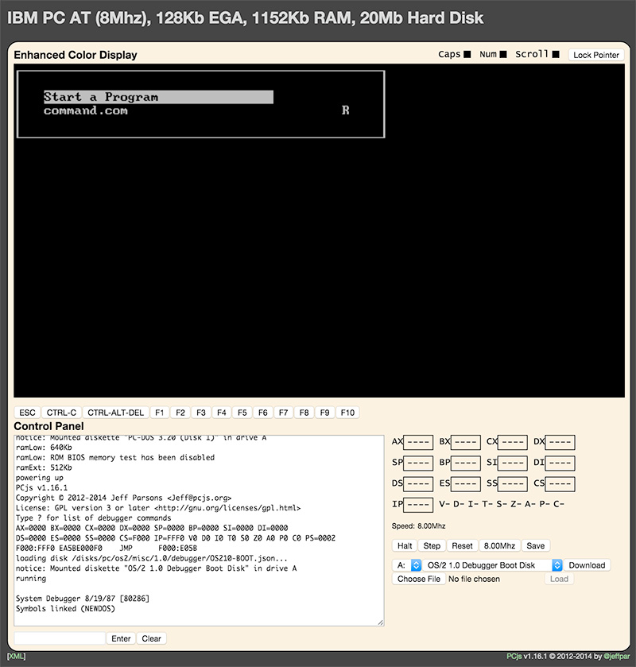

OS/2 1.0
---
Exciting news for OS/2 fans: PCjs (v1.16.1) is now able to run OS/2 1.0 on selected IBM PC AT (80286) machine
configurations.

To test it out, go to [IBM PC Machine Configurations](/devices/pc/machine/), scroll down to the Model 5170 machines,
and choose one.  For drive A:, select "OS/2 1.0 Debug Boot Disk", click "Download", and then click the "Run"
button.

In a few seconds, you'll see a very rudimentary OS/2 shell (a slimmed-down verion of the OS/2 "Program Selector")
that allows you to start the protected-mode command interpreter ("Start a Program") or the real-mode command
interpreter ("command.com").

 
As an added bonus, these Model 5170 PCjs machines feature two serial ports, with COM1 connected to a simulated
serial mouse and COM2 connected to the **Control Panel** output window.

So, once you've booted the "OS/2 1.0 Debug Boot Disk" from our assortment of [OS/2 Miscellaneous Disks](/disks/pc/os2/misc/),
you can click on the **Control Panel** output window, press Ctrl-C, and find yourself magically transported
to the OS/2 Kernel Debugger.  The **Control Panel** display is functioning as both the output window for all PCjs
messages and PCjs Debugger commands, as well as a serial input/output device (aka "Dumb Terminal") for any software
running inside the machine, such as the OS/2 Kernel Debugger.

Type "?" for a list of all OS/2 Kernel Debugger commands.  Type "g" to continue running OS/2.  Make sure you type all
OS/2 Kernel Debugger commands into the **Control Panel** output window.  Commands typed into the input box *beneath*
the output window are only processed by the PCjs Debugger, which retains ultimate control over the entire machine.

There are still a number of known issues with OS/2.  For example, when attempting to install OS/2 1.0 from the
installation diskettes onto a virtual hard disk, OS/2 successfully formats the hard disk and copies the files from
the first two diskettes, but usually while copying files from either the second or third diskette, the process stops.
There's no crash -- it simply stops copying files and never finishes.  My best guess at this point is that some
interrupts are being dropped.

Similarly, if a machine running OS/2 1.0 is left unattended for a few minutes, it may stop responding.  Again, there's
no crash or other indication of a problem.  The machine simply appears hung.  "Ctrl-Alt-Del" and "Reset" buttons still
work.

The journey continues.

*[@jeffpar](http://twitter.com/jeffpar)*  
*December 4, 2014*
